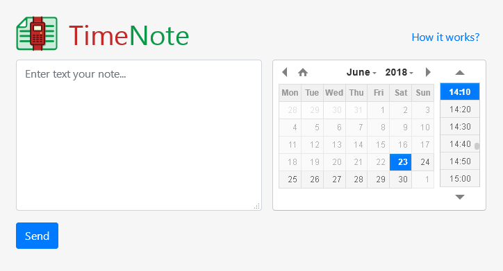

 
# Timenote
<p><a href="./LICENSE.md"></a></p>
Automatically activated messages at the time appointed by you. 
Very convenient to prepare answers to a riddles or to make predictions on sports. 
Activated messages will be deleted after a week.
You will get a unique link, which you can send to your interlocutors.
Messages on the server are stored in an encrypted form. 
We do not store data about you, except the sender's IP.

### Changelog
- version #2 — (May 2020) — Update to Laravel 7
- version #1 — (Jun 2018)  

### Installation
Download the project repository and run the command below
```bash
composer install --no-dev
cp -a .env.example .env
php artisan key:generate
php artisan migrate
```
Configure .env file.

### Used
- PHP 7.4
- Laravel 7
- PHPUnit 9
- Bootstrap 4.5
- jQuery 1.10
- DateTimePicker 2.5
- clipboard.js 2.0
